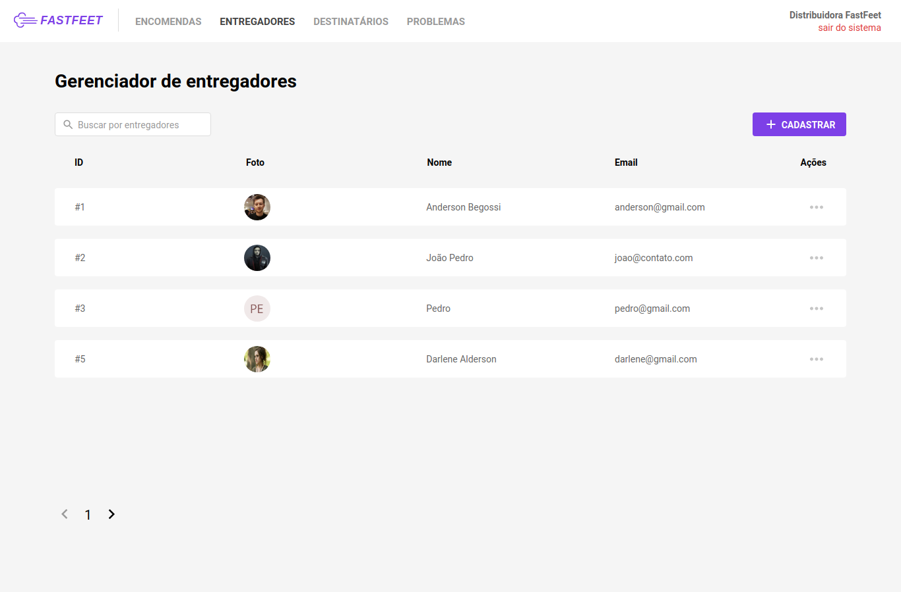
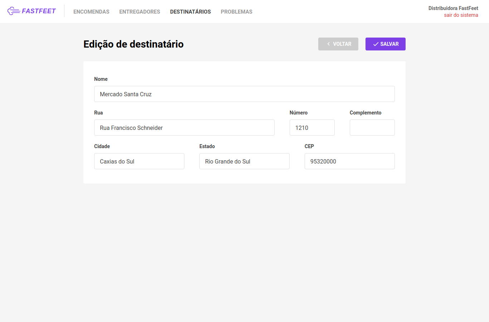

<h1 align="center">
    
    <br>
    Desafio 9: FastFeet, Front-end Web
</h1>

<h4 align="center">
  FastFeet App with React and Redux.
</h4>

<p align="center">
  <a href="https://ambegossi.com">
    
  </a>

  

  

  <a href="https://github.com/ambegossi/fastfeet-web/commits/master">
    
  </a>

  <a href="https://github.com/ambegossi/fastfeet-web/issues">
    
  </a>

  <a href="https://github.com/ambegossi/fastfeet-web/blob/master/LICENSE.md">
  
  </a>

  <a href="https://github.com/ambegossi/fastfeet-web/stargazers">
    
  </a>
</p>

<p align="center">
  <a href="#about">About</a>&nbsp;&nbsp;&nbsp;|&nbsp;&nbsp;&nbsp;
  <a href="#rocket-technologies">Technologies</a>&nbsp;&nbsp;&nbsp;|&nbsp;&nbsp;&nbsp;
  <a href="#information_source-how-to-use">How To Use</a>&nbsp;&nbsp;&nbsp;|&nbsp;&nbsp;&nbsp;
  <a href="#memo-license">License</a>
</p>

## About

[GoStack Bootcamp Challenge 9 🚀👨🏻‍🚀](https://github.com/Rocketseat/bootcamp-gostack-desafio-09)

<p align="center">
  
  
  
</p>

## :rocket: Technologies

- [ReactJS](https://reactjs.org/)
- [Redux](https://redux.js.org/)
- [Redux-Saga](https://redux-saga.js.org/)
- [React Hooks](https://reactjs.org/docs/hooks-intro.html)
- [Axios](https://github.com/axios/axios)
- [History](https://www.npmjs.com/package/history)
- [Immer](https://github.com/immerjs/immer)
- [Polished](https://polished.js.org/)
- [React-Toastify](https://fkhadra.github.io/react-toastify/)
- [styled-components](https://www.styled-components.com/)
- [React-Icons](https://react-icons.netlify.com/)
- [Unform](https://github.com/Rocketseat/unform)
- [Date-fns](https://date-fns.org/docs/Getting-Started)
- [Reactotron](https://infinite.red/reactotron)
- [VS Code][vc] with [EditorConfig][vceditconfig], [ESLint][vceslint] and [Prettier][prettier]

## :information_source: How To Use

To clone and run this application, you'll need [Git](https://git-scm.com), [Node.js v10.16][nodejs] or higher + [Yarn v1.13][yarn] or higher installed on your computer. From your command line:

```bash
# Clone this repository
$ git clone https://github.com/ambegossi/fastfeet-web

# Go into the repository
$ cd fastfeet-web

# Install dependencies
$ yarn install

# Run the app
$ yarn start
```

## :memo: License

This project is under the MIT license. See the [LICENSE](LICENSE.md) for more information.

---

Made with ♥ by Anderson Begossi :wave: [Get in touch!](https://www.linkedin.com/in/anderson-begossi-b5065a130)

[nodejs]: https://nodejs.org/
[yarn]: https://yarnpkg.com/
[vc]: https://code.visualstudio.com/
[vceditconfig]: https://marketplace.visualstudio.com/items?itemName=EditorConfig.EditorConfig
[vceslint]: https://marketplace.visualstudio.com/items?itemName=dbaeumer.vscode-eslint
[prettier]: https://prettier.io/
